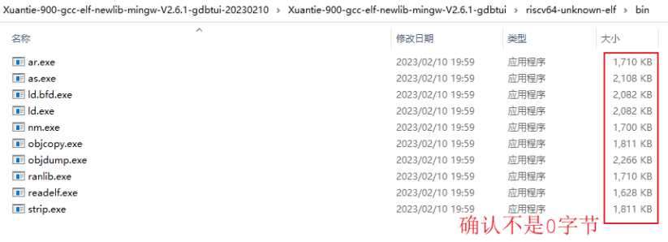
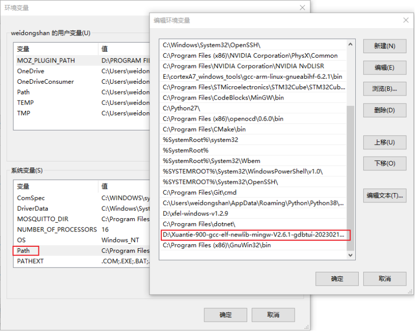
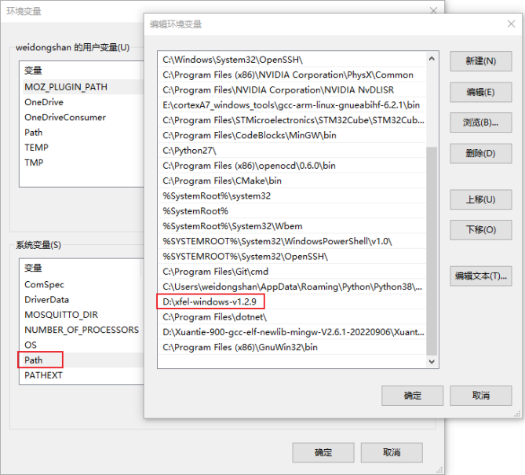
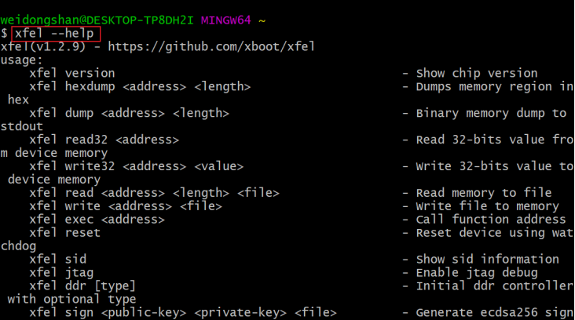
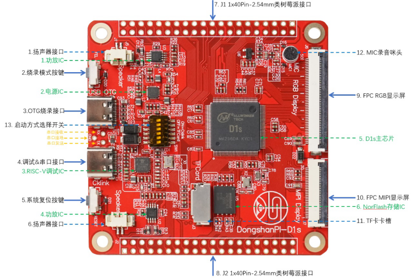
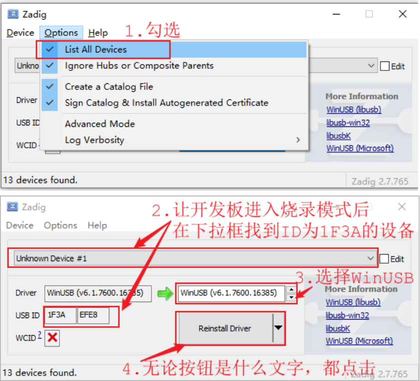
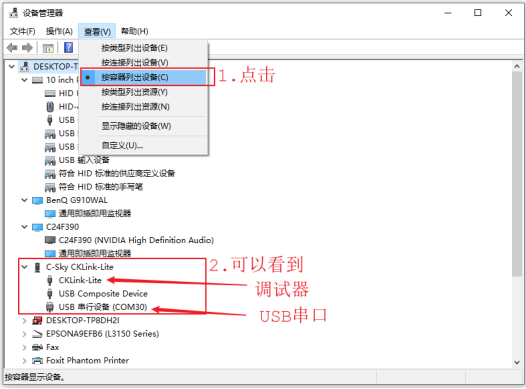
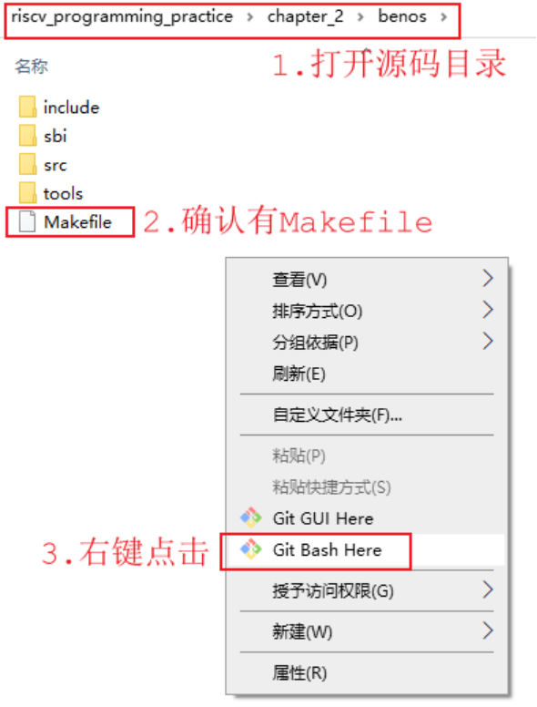
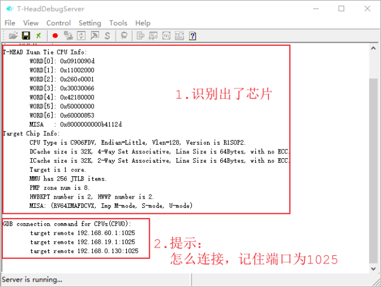

[toc]

## Chapter 1 Environment Construction

## 1.1 Introduction to development board

The source code in "RISC-V Architecture Programming and Practice" written by Zhang Tianfei is based on QEMU simulator, which can be regarded as a virtual development board. If you need to learn on the real development board, you can use the DongshanPI-D1S development board of Baiwen.

DongshanPI-D1S is the smallest development board for learning bare metal and RTOS based on RISC-V architecture launched by Baiwen. The integrated CKLink debugger supports OTG burning, GDB debugging, serial port printing, and exports all the signals of the main chip. The left and right sides are compatible with the power signal definition of raspberry pie, which makes it easy to expand the module.

D1S is an AIoT chip with high performance-price ratio launched by Quanzhi for the intelligent decoding market. It uses the C906 processor with 64bit RISC-V architecture of Alibaba Pingtou, and has 64M DDR2 built in. It supports FreeRTOS, RT-Thread and other RTOS, as well as Linux system. At the same time, it integrates a large number of self-developed audio and video codec-related IPs, which can support H.265, H.264, MPEG-1/2/4, JPEG and other full-format video decoding, and supports multiple audio interfaces such as ADC, DAC, 12S, PCM, DMIC, OWA, and can be widely used in smart home panel, smart business display, industrial control, car and other products.


Board data：http://download.100ask.net/boards/Allwinner/D1s/index.html

Purchase address：https://item.taobao.com/item.htm?id=688098912622


## 1.2 Download materials

The data is divided into two parts: general data of development board and D1S source code of RISC-V Architecture Programming and Practice. The former is relatively large, which is placed on Baidu Netdisk; The latter is placed on the GITEE website supporting the book.

 

General information of development board:
open http://download.100ask.net/boards/Allwinner/D1s/index.html , you can see the Baidu network disk address corresponding to "D1s course supporting general materials", please download it yourself. This course mainly uses the software shown below:


D1S source code of RISC-V Architecture Programming and Practice:
open https://gitee.com/weidongshan/riscv_programming_practice After logging in, press the following interface to operate:


After clicking the "Clone/Download" button, click "Download ZIP" as follows:


If you do not click "Download ZIP" but use the GIT command to download, you need to execute the following command after the download is successful:

```
git checkout DongShanPI_D1
```


## 1.3 安装软件

The following five software needs to be installed, which are all located in the directory of "Development Board General Data  05_Development Kit " of the network disk data:
① "Git  Git-2.39.1-64-bit. exe": We regard it as a command line. We can't use the DOS command line and Powershell that comes with Windows (you can't execute the make command in it)
② "Make  make-3.81. exe": make tool
③ "Toolchain  Xuantie-900-gcc-elf-newlib-mingw-V2.6.1-gdbtui-20230210. tar. gz": This is a cross-compilation tool for Windows version and supports TUI
④ "CKLinkServer  T-Head-DebugServer-windows-V5.16.6-20221102-1510. zip": This is the debugging service software
⑤ "Xfe  xfe. exe": burning tool

 

### 1.3.1 Git Bash

Double-click "Development Board General Data  05_Development Kit  Git  Git-2.39.1-64-bit.exe" to install it.
There are two ways to start Git Bash:
① Click "Start ->Git ->Git Bash"
② After entering a directory in the file browser, right-click in the blank space and select "Git Bash Here"
The usage of various commands in Git Bash is exactly the same as that in Linux, such as "cd", "ls", and "rm". In Git Bash, the path is also represented in the same way as in Linux. For example, the abc subdirectory under disk D is represented by "/d/abc" instead of "D:  abc".
A simple example of using commands in Git Bash is as follows:


### 1.3.2 make

Double-click "Development Board General Data  05_Development Kit  make  make-3.81.exe" to install it. When installing, remember the installation path. You need to put the bin directory under the installation path into the environment variable Path.


Add "C:  Program Files (x86)  GnuWin32  bin" to the environment variable Path as shown below:


Verification: After starting Git Bash, execute the "make - v" command, as shown in the following figure.


### 1.3.3 cross tool chain

Unpack the "Development Board General Data  05_Development Kit  toolchain  Xuantie-900-gcc-elf-newlib-mingw-V2.6.1-gdbtui-20230210. tar. gz", and note that the path name does not contain Chinese.
After decompression, make sure that the file in the following directory is not 0 bytes:



Using some decompression tools, such as banzip, may result in 0 bytes of files. It is recommended to use 7-Zip for decompression.
After decompression, you can see the "riscv64-unknown-elf-gcc.exe" file, as shown in the following figure:


You need to put the directory where the "riscv64-unknown-elf-gcc.exe" file is located into the Path environment variable. Please refer to 1.3.2 Make for details. The results are as follows:




Verification: After starting Git Bash, execute the "riscv64-unknown-elf-gcc - v" command, as shown in the following figure (Git Bash supports the command completion function, and pressing TAB after entering "risc" will automatically complete the command).


### 1.3.4 commissioning service software

First extract the file: "Development Board General Data  05_Development Kit  CKLinkServer  T-Head-DebugServer-windows-V5.16.6-20221102-1510. zip".
Double-click "setup. exe" inside to install.

 

### 1.3.5 burn tool

Copy the "Development Board General Data  05_Development Kit  xfel" directory to other non-Chinese paths.
You also need to put the directory where the "xfel. exe" file is located into the Path environment variable. Please refer to 1.3.2 Make for details. The results are as follows:  




Verification: After starting Git Bash, execute the "xfel -- help" command, as shown in the following figure.




## 1.4 Installing  driver

The interfaces of DongshanPI-D1S development board are shown in the following figure:



D1S itself supports USB-OTG burning (corresponding to the above interface "3. OTG burning interface"), which requires the installation of the corresponding driver.
The DongshanPI-D1S development board integrates the CKLink debugger (corresponding to the above interface "4. Debugging&Serial Port Interface"). It has two functions: debugging and USB serial port. Two drivers need to be installed.


### 1.4.1 OTG burning driver

After connecting the "3. OTG burning interface" of the development board with the USB cable to the computer, first press and hold the "2. Burning mode key" without releasing it, then press and release the "5. System reset key", and finally release the "2. Burning mode key", and the development board will enter the burning mode.
When using burn mode for the first time, install the driver first, run the program "Development Board General Data  05_ Development Kit  xfel  Drivers  zadig-2.7. exe", and then operate as follows:



Note: In step 4 of the above figure, the button content may be "Install Driver", "Replace Driver" or "Reinstall Driver", which are all clicked the same way. 

 Verification: After installing the driver, use the button to put the board into burning mode, and then execute the command in Git Bash to detect the device:


If the device is not found, you can try several times:
① Use the button to put the development board into burning mode
② Reinstall the driver or even restart the computer
③ Plug into other USB ports of the computer

 

### 1.4.2 USB serial port and debugger 

After connecting the "4. Debugging&Serial Port Interface" of the development board with USB cable to the computer, it will automatically install 2 drivers. Open the device manager to see the following devices:




#Chapter 2 Experience the first procedure
##2.1 Compile, burn and run
###2.1.1 Compilation


## Chapter 2 Experience the first procedure

### 2.1 Compile, burn and run

### 2.1.1  Compilation

​	Enter the source directory first and open Git Bash, as shown in the following figure:



Then execute the "make" command in Git Bash to generate benos_ The payload.bin file is shown in the following figure:


### 2.1.2 Burning operation

Use two USB cables to connect "3. OTG burning interface" and "4. Debugging&serial port interface" of the development board respectively. Use the serial port tool to open the serial port. The baud rate is set to 115200,8 data bits and 1 stop bit, without using flow control.
The burning method is as follows:
① Let the development board enter the burning mode first:
The method is: first press and hold "2. Burn mode key" without releasing, then press and release "5. System reset key", and finally release "2. Burn mode key".
② Then execute the "make burn" command in Git Bash
As shown in the figure below:


After the burning is successful, press and release the "5. System reset button" to start the program. You can see the output information on the serial port:


## 2.2 debugging

### 2.2.1  GDB Common Commands

When using GDB debugging, two software are involved:
① "Riscv64-unknown-elf-gdb" running in Git Bash: it issues various debugging commands, such as connecting debugging service software (T-HeadDebugServer), single-step running, viewing variables, etc
② T-HeadDebugServer: it is the "debugging service software", responsible for receiving and processing various debugging commands
Common commands are shown in the following table:

| Commands          | **Abbreviated form** | **Description**                                              |
| ----------------- | -------------------- | ------------------------------------------------------------ |
| target            |                      | Connect to the debugging server, for example: target remote 127.0.0.1:1025 |
| run               | r                    | Run program                                                  |
| continue          | c、cont              | Continue to run                                              |
| break             | b                    | Set breakpoints, such as: b sbi_main.c:121  b sbi_main  b \*0x20000 |
| delete            | d                    | Remove Breakpoint                                            |
| disable           | dis                  | Disable breakpoints                                          |
| info  breakpoints | info b               | Display breakpoint information                               |
| next              | n                    | Execute next line                                            |
| nexti             | ni                   | Execute the next line (in assembly code)                     |
| step              | s                    | Execute one line at a time, including the function           |
| setpi             | si                   | Execute next line                                            |
| list              | l                    | Show functions or rows                                       |
| print             | p                    | Display the expression, such as: print a print $pc//print register print  * 0x20000//print memory print/x a//hexadecimal print |
| x                 |                      | Display memory contents, such as: x 0x20000 x/x 0x20000//hexadecimal |
| info  registers   | infor  r             | Print the value of all registers                             |
| set               |                      | Design variables, such as: #set was a=1 \* (unsigned int \*)0x28000 = 0x55555555 > set was $pc=0x22000 |
| finish            |                      | Run to the end of the function                               |
| help              | h                    | Show help at a glance                                        |
| backtrace         | bt、where            | Show backtrace                                               |
| symbol-file       |                      | Load the symbol table, such as symbol-file benes.elf         |


### 2.2.2 benos_ Payload program composition

The code in RISC-V Architecture Programming and Practice is divided into two parts:
① Mysbi.elf: the underlying software running in M mode, providing various system services
② Benos.elf: application software running in S mode
benos_ Payload is a combination of these two parts of programs:

```
benos_payload.elf = mysbi.elf + benos.elf
benos_payload.bin = mysbi.bin + benos.bin
```

Burn and run benos_ When payload.bin, the mysbi program will be run first, and then mysbi will start benos. Debug benos_ When payload.elf, we can debug mysbi first, and then debug benos after benos is started.


### 2.2.3 Commissioning preparation

First, start the debugging function of CKLink by tearing the film on the dial switch indicated by the blue arrow in the figure below and turning all dial switches to the left (USB interface side):


Then, start the debugging service software "T-HeadDebugServer", which will automatically detect the chip, as shown in the following figure:



If there is no information shown above, there are many possibilities:
① No automatic recognition:
It can be identified manually, as shown in the figure below:


② The program on the board has a bug, which causes the board to crash: you can let the board enter the burning mode first, and then follow step ①
③ Prompt 1025 port is occupied: run the task manager, kill all "T-HeadDebugServers", and then run "T-HeadDebugServer" again
After "T-HeadDebugServer" identifies the chip, you can debug the program in two ways:
① Debugging using command line mode
② Debug using TUI mode


### 2.2.4 Command line debugging example

After "T-HeadDebugServer" identifies the chip, it can execute "riscv64-unknown-elf-gdb benos_payload. elf" in Git Bash to debug the program.
Examples are as follows:

```
weidongshan@DESKTOP-TP8DH2I MINGW64 /d/abc/riscv_programming_practice/chapter_2/benos (DongShanPI_D1)
$ riscv64-unknown-elf-gdb benos_payload.elf
Reading symbols from benos_payload.elf...
(gdb) target remote 127.0.0.1:1025       //Connect debugging service software
Remote debugging using 127.0.0.1:1025
0x000000000000a22a in ?? ()
(gdb) load   // load benos_payload.elf
Loading section .text.boot, size 0x44 lma 0x20000
        section progress: 100.0%, total progress:  0.38%
Loading section .text, size 0x538 lma 0x20044
        section progress: 100.0%, total progress:  7.81%
Loading section .rodata, size 0xc0 lma 0x2057c
        section progress: 100.0%, total progress:  8.88%
Loading section .data, size 0x1000 lma 0x21000
        section progress: 100.0%, total progress: 31.66%
Loading section .payload, size 0x3000 lma 0x22000
        section progress: 100.0%, total progress: 100.00%
Start address 0x0000000000020000, load size 17980
Transfer rate: 209 KB/sec, 1997 bytes/write.
(gdb) x /x 0x20000   // Check whether 0x20000 is written correctly,
// When we debug the program, we may not be able to load because of the last crash
// At this time, you can put the board into burning mode, and then reconnect and reload it
0x20000 <text_begin>:   0x0300006f
(gdb) b sbi_main   // Set breakpoint to sbi_ Main function
Breakpoint 1 at 0x204bc: file sbi/sbi_main.c, line 80.
(gdb) c            // implement
Continuing.

Breakpoint 1, sbi_main () at sbi/sbi_main.c:80
80              sbi_set_pmp(0, 0, -1UL, PMP_RWX);
(gdb) n        // next step
84              val = read_csr(mstatus);
(gdb) b sbi_main.c:102    // Set breakpoint to sbi_ Line 102 of main. c
Breakpoint 2 at 0x20564: file sbi/sbi_main.c, line 102.
(gdb) info b    // View all breakpoints
Num     Type           Disp Enb Address            What
1       breakpoint     keep y   0x00000000000204bc in sbi_main
                                                   at sbi/sbi_main.c:80
        breakpoint already hit 1 time
2       breakpoint     keep y   0x0000000000020564 in sbi_main
                                                   at sbi/sbi_main.c:102
(gdb) i b    // View all breakpoints, abbreviated commands
Num     Type           Disp Enb Address            What
1       breakpoint     keep y   0x00000000000204bc in sbi_main
                                                   at sbi/sbi_main.c:80
        breakpoint already hit 1 time
2       breakpoint     keep y   0x0000000000020564 in sbi_main
                                                   at sbi/sbi_main.c:102
(gdb) c   // Continue execution
Continuing.

Breakpoint 2, sbi_main () at sbi/sbi_main.c:102  // I hit a breakpoint
// After executing the next sentence of code, you will jump to the benos program
102             asm volatile("mret");
(gdb) si  // Step into the function and execute one assembly statement at a time
0x0000000000022000 in payload_bin ()  // Now we need to execute another program, benos
(gdb) symbol-file benos.elf  // Read the symbol table of benos.elf, otherwise you cannot know the function, code and other information when debugging
Load new symbol table from "benos.elf"? (y or n) [answered Y; input not from terminal]
Reading symbols from benos.elf...
Error in re-setting breakpoint 1: Function "sbi_main" not defined.
Error in re-setting breakpoint 2: No source file named sbi_main.c.
(gdb) si  // Step into the function and execute one assembly statement at a time
9               la sp, stacks_start
(gdb) b kernel_main  // Set breakpoint to kernel_ Main function
Breakpoint 3 at 0x22020: file src/kernel.c, line 6.
(gdb) c    // Continue execution
Continuing.

Breakpoint 3, kernel_main () at src/kernel.c:6
6           sys_clock_init();
(gdb) i r   // List the values of all registers
ra             0x204d0  0x204d0
sp             0x24ff0  0x24ff0
gp             0x0      0x0
tp             0x0      0x0
t0             0x1000   4096
t1             0xfffffffffffff000       -4096
t2             0x109    265
fp             0xa00000900      0xa00000900
s1             0x0      0
a0             0x0      0
a1             0x1f     31
a2             0xffffffffffffffff       -1
a3             0x0      0
a4             0xa00000100      42949673216
a5             0x0      0
a6             0x80     128
a7             0x1c0    448
s2             0x375bff17       928775959
s3             0xff32dec        267595244
s4             0x2eebeffb       787214331
s5             0xffffffffffdf9ffd       -2121731
s6             0x355077ff       894466047
s7             0xffffffffef7eeee9       -276893975
s8             0x27034  159796
s9             0xffffffffe6376ff3       -432574477
s10            0xffffffffb9d37bfc       -1177322500
s11            0x78b47e70       2025094768
t3             0x1      1
t4             0xefe8   61416
t5             0x8001   32769
t6             0x0      0
pc             0x22020  0x22020 <kernel_main+8>
(gdb) l   // List Codes
1       #include "clock.h"
2       #include "uart.h"
3
4       void kernel_main(void)
5       {
6           sys_clock_init();
7               uart_init();
8
9               while (1) {
10              uart_send_string("Welcome RISC-V!\r\n");
(gdb) l
11                      ;
12              }
13      }
(gdb) c     // Continue execution
Continuing.

Program received signal SIGINT, Interrupt. // Press Ctrl+C to stop the program
read32 (addr=38797436) at include/io.h:23
23      }
(gdb) quit  // Exit debugging
```


The commands used in the above debugging process have comments, excerpts are as follows:

```
$ riscv64-unknown-elf-gdb benos_payload.elf  // Start debugging
(gdb) target remote 127.0.0.1:1025       // Connect debugging service software
(gdb) load   // Load benos_ payload.elf
(gdb) x /x 0x20000      // Check whether 0x20000 is written correctly,
// When we debug the program, we may not be able to load because of the last crash
// At this time, you can put the board into burning mode, and then reconnect and reload it
(gdb) b sbi_main   // Set breakpoint to sbi_main function
(gdb) c            // implement
(gdb) n            // next step
(gdb) b sbi_main.c:102    // Set breakpoint to Line 102 of sbi_main. c
(gdb) info b    // View all breakpoints
(gdb) i b       // View all breakpoints, abbreviated commands
(gdb) c         // Continue execution
(gdb) si        // Step into the function and execute one assembly statement at a time
(gdb) symbol-file benos.elf  // Read the symbol table of benos.elf, otherwise you cannot know the function, code and other information when debugging
(gdb) si  // Step into the function and execute one assembly statement at a time
(gdb) b kernel_main  // Set breakpoint to kernel_main function
(gdb) c     // Continue execution
(gdb) i r   // List the values of all registers
(gdb) l     // List Codes
(gdb) l
(gdb) c     // Continue execution
Program received signal SIGINT, Interrupt. // Press Ctrl+C to stop the program
(gdb) quit  // Exit debugging
```


benos_ Payload.elf is a combination of two programs. The key points of debugging are:
① When debugging the first program, the default is from benos_ Get the symbol table in payload.elf
② When executing the second program, you need to use the "symbol file benos. elf" command to read the symbol table of benos. elf, otherwise you cannot know the function, code and other information when debugging.
③ How do I know that the second program has been executed? Can be found in sbi_ Set breakpoints (such as "b sbi_main. c: 102") at the following red box code in main. c. After the breakpoint is executed, execute the "si" command to start the second program:


### 2.2.5 TUI debugging example

After "T-HeadDebugServer" identifies the chip, it can execute "riscv64-unknown-elf-gdb - tui benos_payload. elf" in Powershell to debug the program.
Note: TUI function cannot be used in Git Bash. Powershell is required.
Start Powershell first: After entering the source code directory, press and hold the shift key while clicking the right mouse button to start Powershell in the pop-up menu, as shown in the following figure:


In the Powershell window, execute the following command to start debugging:

```
riscv64-unknown-elf-gdb  -tui  benos_payload.elf
```

 After executing the above command, you can get the following interface (the Chinese characters in the source code window are garbled and cannot be solved temporarily):


The convenience of using TUI is that you can easily view the source code, reverse sink code, and register. The window that displays these information is called layout. Use the following command to display these layouts:
① Layout src: display the source code window
② Layout asm: display the assembly window
③ Layout regs: display the register window again on the previous window
④ Layout split: display source code and assembly window
⑤ Layout next: display the next layout
⑥ Layout prev: display the previous layout
The window that can input various GDB commands is the "command window", which is always displayed.
To display the source code and registers at the same time, you can execute the following two commands:

```
layout src
layout regs
```

 

To display the reverse sink code and register at the same time, you can execute the following two commands:

```
layout asm
layout regs
```

 

To display the source code and the reverse exchange code at the same time, you can execute the following command:

```
layout split
```

 

When using the TUI mode, it is only convenient for us to view the source code, reverse sink code, and register. For specific operation, please enter the GDB command in the command window. Please refer to 2.2.4 Command Line Debugging Example.


### 2.2.6 gdb script

If you don't want to execute "riscv64-unknown-elf-gdb benos_payload. elf" or "riscv64-unknown-elf-gdb - ui benos_payload. elf" each time, you should manually execute the following command to connect the debugging service software:
```
(gdb) target remote 127.0.0.1:1025//Connect debugging service software
```


You can write these commands to a file named ". gdbinit". Note that the first character of the file name is ".", which means it is a hidden file under Linux system. We can see it in the Windows file browser, but we can't see it in Git Bash by executing the "ls" command. We need to execute the "ls - a" command to see it.
You can put more commands in ". gdbinit". Here is an example:

```
target remote 127.0.0.1:1025
load
b sbi_main.c:102
```

